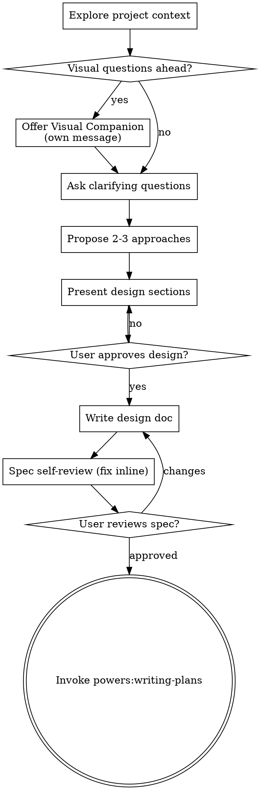

# Brainstorming Ideas Into Designs

Turn ideas into validated designs and specs through collaborative dialogue. Understand context, ask questions one at a time, propose a design, get approval, write it down.

<HARD-GATE>
Do NOT invoke any implementation skill, write code, scaffold files, or take any implementation action until you have presented a design and the user has approved it. Applies to EVERY project, regardless of perceived simplicity.
</HARD-GATE>

## Anti-pattern: "this is too simple to need a design"

Every project goes through this — a todo list, a single config flag, a CI tweak, a small schema change. "Simple" is where unexamined assumptions cause the most wasted work. Designs can be short (a few sentences) but you MUST present one and get approval.

## Checklist

Create one task per item and complete in order:

1. **Explore project context** — files, docs, recent commits, existing modules / pipelines.
2. **Offer the visual companion** if upcoming questions are visual (own message, no other content). See "Visual Companion" below.
3. **Ask clarifying questions** — one at a time. Purpose, constraints, success criteria.
4. **Propose 2-3 approaches** — with trade-offs and your recommendation.
5. **Present the design** in sections sized to their complexity; get approval after each section.
6. **Write the design doc** to `docs/powers/specs/YYYY-MM-DD-<topic>-design.md` and commit.
7. **Spec self-review** — placeholders, contradictions, ambiguity, scope (see below).
8. **User reviews the written spec** before proceeding.
9. **Transition to implementation** — invoke `powers:writing-plans`.

## Process flow

**Terminal state:** `powers:writing-plans`. The ONLY skill you invoke after brainstorming is `powers:writing-plans` — never any implementation skill directly.

## Process detail

**Understanding the idea:**

- Read project state first (files, docs, recent commits, existing modules / CI templates / shared libraries).
- Scope check: if the request describes multiple independent subsystems (e.g., "build a platform with auth, storage, billing, telemetry"), flag it now and decompose into sub-projects before refining details.
- For appropriately-scoped projects, ask one question at a time. Prefer multiple choice. Focus on purpose, constraints, success criteria.

**Approaches:**

- Propose 2-3 with trade-offs.
- Lead with your recommendation and the reasoning.

**Presenting the design:**

- Scale each section to its complexity (a sentence to 200-300 words).
- Ask after each section if it looks right.
- Cover: architecture, components, data flow, error handling, testing, rollout.
- Be ready to revisit if something doesn't fit.

**Design for isolation and clarity:**

- Each unit has one clear purpose, well-defined interface, can be understood and tested independently.
- For each unit, answer: what does it do, how do you use it, what does it depend on?
- Smaller, well-bounded units are easier to reason about.

**Existing codebases:**

- Follow existing patterns. Where the surrounding code has problems that affect the work (file too large, tangled responsibilities), include targeted improvements. Don't propose unrelated refactoring.

## After the design

**Documentation:**

- Write the validated spec to `docs/powers/specs/YYYY-MM-DD-<topic>-design.md` (user preference overrides).
- If the `elements-of-style:writing-clearly-and-concisely` skill is available, use it.
- Commit.

**Spec self-review:**

1. **Placeholders:** any "TBD", "TODO", incomplete sections, vague requirements? Fix.
2. **Internal consistency:** sections agree? Architecture matches feature descriptions?
3. **Scope:** focused enough for one plan, or does it need decomposition?
4. **Ambiguity:** any requirement that could be read two ways? Pick one and say it.

Fix inline. No re-review loop.

**User review gate:**

> "Spec written and committed to `<path>`. Please review and let me know if you want changes before we move to the implementation plan."

Wait for the response. If changes requested, make them and re-run the self-review. Only proceed once approved.

**Implementation:**

- Invoke `powers:writing-plans`. Do NOT invoke any other skill.

## Key principles

- One question at a time.
- Multiple choice preferred.
- YAGNI ruthlessly — strip unnecessary features from designs.
- Always propose 2-3 alternatives before settling.
- Incremental validation — approval per section.
- Be flexible — go back and clarify when something doesn't make sense.

## Visual Companion

A browser-based companion for showing mockups, diagrams, and visual options during brainstorming. It's a tool, not a mode — accepting it means it's available; not every question goes through the browser.

**Offering it** (only when you anticipate visual questions, e.g., wireframes, layouts, architecture diagrams). One offer, in its own message, nothing else attached:

> "Some of what we're working on might be easier to explain if I can show it to you in a web browser. I can put together mockups, diagrams, comparisons, and other visuals as we go. This feature is still new and can be token-intensive. Want to try it? (Requires opening a local URL.)"

Wait for the response. If declined, continue text-only.

**Per-question decision** even after acceptance: would the user understand this better seeing it than reading it?

- **Browser:** mockups, wireframes, layout comparisons, architecture diagrams, side-by-side visual designs.
- **Terminal:** requirements questions, conceptual choices, tradeoff lists, A/B/C/D text options, scope decisions.

A UI topic isn't automatically a visual question. *"What does personality mean here?"* is conceptual — terminal. *"Which wizard layout works better?"* is visual — browser.

If accepted, read `brainstorming/visual-companion.md` before proceeding.
