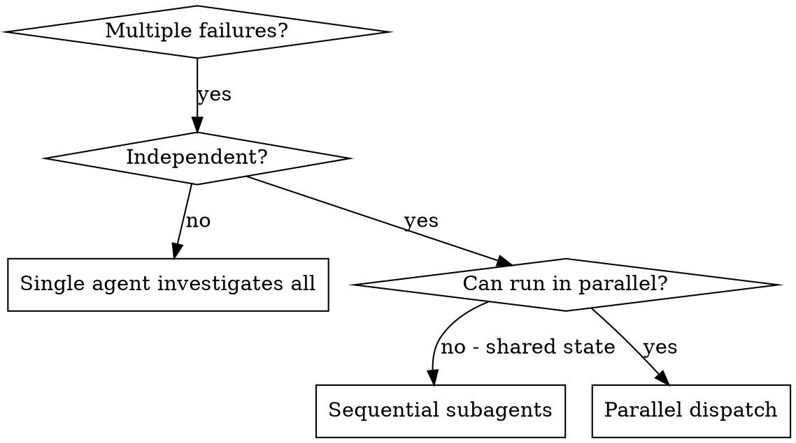

# Dispatching Parallel Agents

Delegate independent problems to fresh subagents (`task`) so investigations run concurrently. Each subagent gets isolated context you craft — never your session history. This keeps them focused and protects your own context for coordination.

**Core principle:** one subagent per independent problem domain. Run them concurrently.

## When to use



**Use when:**

- 3+ test files / CI jobs / modules failing for different root causes.
- Multiple subsystems broken independently.
- Each problem is understandable without context from the others.

**Don't use when:**

- Failures look related (one fix may cure several — investigate together).
- You don't yet know what's broken.
- Subagents would touch the same files / state.

## Pattern

### 1. Identify independent domains

Group failures by what's broken. Examples:

- File A: tool-approval flow.
- File B: batch-completion behavior.
- Module C: IAM policy diff.

### 2. Craft focused tasks

Each subagent gets:

- **Scope:** one file / module / subsystem.
- **Goal:** what "done" looks like.
- **Constraints:** "don't change other code".
- **Output:** "summary of root cause and fix".

### 3. Dispatch in parallel

Issue multiple `task` calls in one message — they run concurrently.

```text
task(...) → "Fix agent-tool-abort.test.ts failures"
task(...) → "Fix batch-completion-behavior.test.ts failures"
task(...) → "Fix tool-approval-race-conditions.test.ts failures"
```

For IaC or multi-module repos, the same shape works — one subagent per independent plan diff or subsystem.

### 4. Review and integrate

When subagents return:

- Read each summary.
- Check for conflicts (did two of them edit the same file?).
- Run the full suite (project tests, IaC plan, CI) to verify combined state.
- Spot-check — subagents can make systematic errors.

## Prompt structure

A good subagent prompt is:

1. **Focused** — one clear domain.
2. **Self-contained** — every piece of context the subagent needs.
3. **Specific about output** — return summary of root cause and changes.

```markdown
Fix the 3 failing tests in src/agents/agent-tool-abort.test.ts:

1. "should abort tool with partial output" — expects 'interrupted at' in message.
2. "should handle mixed completed and aborted tools" — fast tool aborted instead of completed.
3. "should properly track pendingToolCount" — expects 3 results, gets 0.

Likely timing / race conditions. Tasks:

1. Read the test file. Understand what each test verifies.
2. Identify root cause — timing or actual bug?
3. Fix by replacing arbitrary timeouts with event-based waiting,
   correcting bugs in abort impl, or adjusting expectations
   if behavior was intentionally changed.

Do NOT just bump timeouts.

Return: summary of root cause and the fix.
```

## Common mistakes

| Mistake | Fix |
|---|---|
| "Fix all the tests" | Name the specific file / module. |
| No context | Paste error messages, test names, log snippets. |
| No constraints | Say "do not touch production code" or "tests only". |
| Vague output ("fix it") | "Return root cause and the change you made." |

## Don't use when

- Failures are related (fix one might fix many) — investigate together first.
- You need full system context to understand the issue.
- Exploratory debugging — you don't know what's broken yet.
- Shared state — subagents would step on each other (same files, same locks).

## Verification after return

1. Read each summary.
2. Confirm no conflicting edits.
3. Run the full suite.
4. Spot-check — subagent reports can be optimistic.
