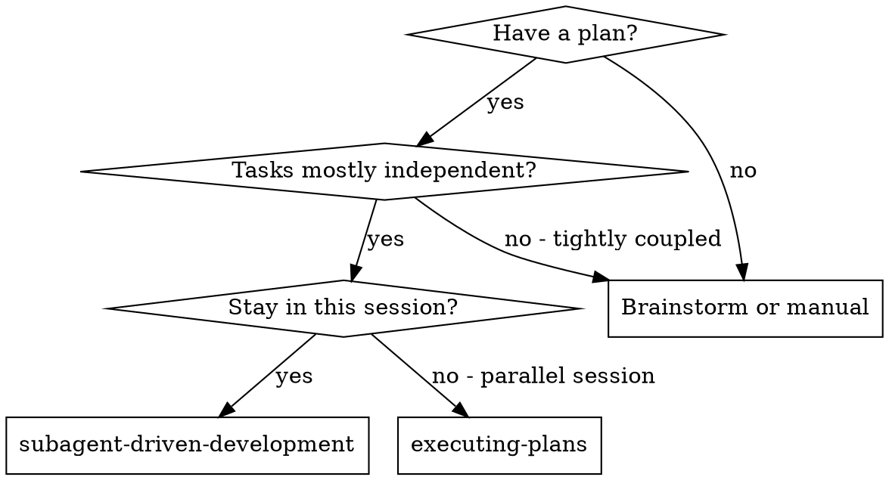
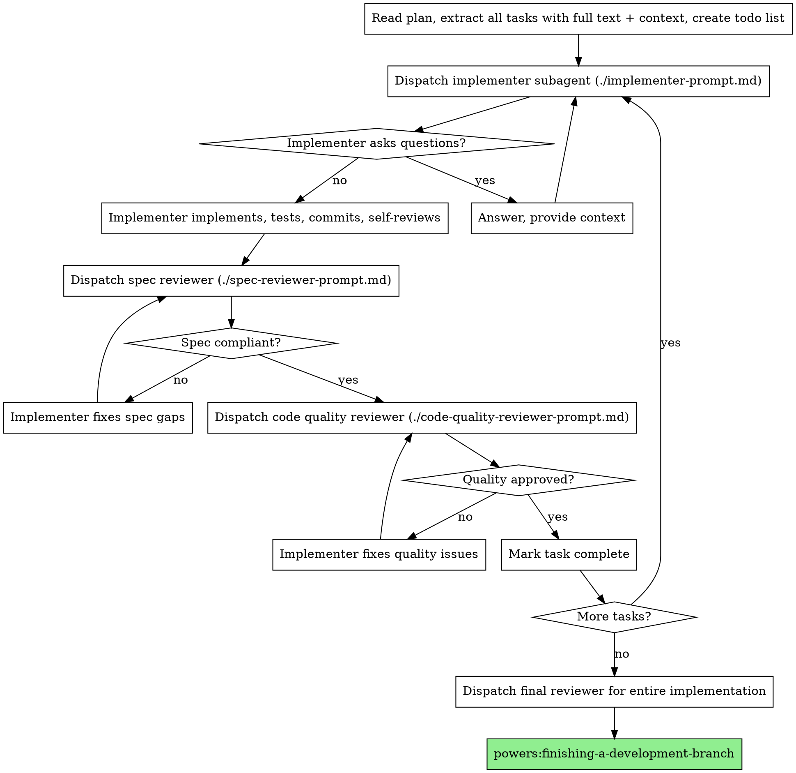

# Subagent-Driven Development

Execute the plan by dispatching a fresh subagent per task, then run a two-stage review per task: spec compliance first, then code quality.

**Why subagents:** isolated context per task. You craft exactly the prompt the subagent needs. They don't inherit your session, so they stay focused, and your own context is preserved for coordination.

**Core principle:** fresh subagent per task + two-stage review = high quality, fast iteration.

## When to use



vs. `powers:executing-plans`:

- Same session (no context switch).
- Fresh subagent per task (no context pollution).
- Two-stage review per task.
- Faster iteration (no human-in-loop between tasks).

## Process



## Model selection

Use the least powerful model that handles the role.

- **Mechanical implementation** (isolated function, clear spec, 1-2 files; e.g., one config entry, one lint fix, one CI step) → fast, cheap model.
- **Integration / judgment** (multi-file coordination, pattern matching, debugging) → standard model.
- **Architecture / design / review** → most capable model.

Signals:

- 1-2 files + complete spec → cheap.
- Multi-file with integration concerns → standard.
- Design judgment / broad codebase reasoning → most capable.

## Implementer status handling

The implementer reports one of four:

- **DONE** — proceed to spec review.
- **DONE_WITH_CONCERNS** — read concerns. Address correctness/scope concerns before review; treat observations as notes and proceed.
- **NEEDS_CONTEXT** — provide missing info, re-dispatch.
- **BLOCKED** — assess:
  1. Context problem → more context, same model.
  2. Reasoning required → re-dispatch on a more capable model.
  3. Task too large → break it up.
  4. Plan is wrong → escalate to the human.

Never ignore an escalation or force the same model to retry without changes.

## Prompt templates

- `./implementer-prompt.md`
- `./spec-reviewer-prompt.md`
- `./code-quality-reviewer-prompt.md`

## Example

```text
Using subagent-driven development to execute this plan.

[Read plan once: docs/powers/plans/feature-plan.md]
[Extract all 5 tasks with full text + context]
[Create todos for all tasks]

Task 1: install hook script
[Dispatch implementer with full task text + context]
Implementer: "User-level or system-level hook?"
You: "User level (~/.config/powers/hooks/)"
Implementer: implements, 5/5 tests pass, self-review caught a missing --force, committed.

Spec reviewer: ✅ all requirements met, nothing extra.
Code reviewer: ✅ approved.
Mark Task 1 complete.

Task 2: recovery modes
Implementer: implements, 8/8 pass, committed.
Spec reviewer: ❌ missing progress reporting (spec says "every 100"); extra --json flag.
Implementer: removes --json, adds progress reporting.
Spec reviewer: ✅ compliant.
Code reviewer: Important — magic 100. Implementer extracts PROGRESS_INTERVAL.
Code reviewer: ✅ approved.
Mark Task 2 complete.

...

Final reviewer: all requirements met, ready to merge.
Done.
```

## Advantages

vs. **manual:** subagents follow TDD naturally; fresh context per task; parallel-safe; can ask questions before AND during work.

vs. **executing-plans:** same session (no handoff); continuous progress; review checkpoints automatic.

**Efficiency:** controller curates exactly the context the subagent needs (no file-reading overhead); questions surfaced before work begins.

**Quality gates:** self-review → spec compliance → code quality. Spec reviewer prevents over/under-building. Code reviewer ensures the implementation is well-built.

**Cost:** more subagent invocations (1 implementer + 2 reviewers per task) and more controller prep, but catches issues early.

## Red flags

**Never:**

- Start implementation on `main`/`master` without explicit user consent.
- Skip either review (spec OR code quality).
- Proceed with unfixed issues.
- Dispatch multiple implementers in parallel for the same code (conflicts).
- Make the subagent read the plan file (provide full text instead).
- Skip scene-setting context (subagent must know where the task fits).
- Ignore subagent questions.
- Accept "close enough" on spec compliance.
- Skip the re-review after a fix.
- Let implementer self-review replace actual review.
- **Start code quality review before spec compliance is ✅.**
- Move to the next task while either review has open issues.

**If subagent asks questions:** answer clearly and completely.

**If reviewer finds issues:** same implementer fixes; reviewer re-reviews; repeat until approved.

**If subagent fails:** dispatch a fix subagent with specific instructions; don't fix manually (context pollution).

## Integration

**Required:**

- `powers:writing-plans` — produces the plan you execute.
- `powers:requesting-code-review` — template for reviewer subagents.
- `powers:finishing-a-development-branch` — complete after all tasks.

**Subagents should use:** `powers:test-driven-development`.

**Alternative:** `powers:executing-plans` (parallel session instead of same-session).
