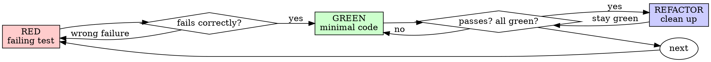

# Test-Driven Development (TDD)

Write the test first. Watch it fail. Write minimal code to pass.

**Core principle:** if you didn't watch the test fail, you don't know if it tests the right thing.

**Violating the letter of these rules is violating the spirit of them.**

## When to use

**Always:**

- New features.
- Bug fixes.
- Refactoring.
- Behavior changes.

**Exceptions (ask the human partner):**

- Throwaway prototypes.
- Generated code.
- Pure configuration files.

Thinking "skip TDD just this once"? Stop. That's rationalization.

## The Iron Law

```text
NO PRODUCTION CODE WITHOUT A FAILING TEST FIRST
```

Wrote code before the test? Delete it. Start over.

**No exceptions:**

- Don't keep it as "reference".
- Don't "adapt" it while writing the test.
- Don't even look at it.
- Delete means delete.

Implement fresh from the tests.

## Red-Green-Refactor



### RED — failing test

One minimal test showing what should happen.

<Good>

```typescript
test('retries failed operations 3 times', async () => {
  let attempts = 0;
  const operation = () => {
    attempts++;
    if (attempts < 3) throw new Error('fail');
    return 'success';
  };

  const result = await retryOperation(operation);

  expect(result).toBe('success');
  expect(attempts).toBe(3);
});
```

Clear name, real behavior, one thing.
</Good>

<Bad>

```typescript
test('retry works', async () => {
  const mock = jest.fn()
    .mockRejectedValueOnce(new Error())
    .mockRejectedValueOnce(new Error())
    .mockResolvedValueOnce('success');
  await retryOperation(mock);
  expect(mock).toHaveBeenCalledTimes(3);
});
```

Vague name, tests the mock not the code.
</Bad>

**Requirements:** one behavior, clear name, real code (mocks only when unavoidable).

### Verify RED — watch it fail

**Mandatory. Never skip.**

```bash
# Examples by stack
pytest path/to/test.py::test_name -v
npm test path/to/test.test.ts
go test ./path -run TestName

# IaC test (tool-specific)
<project iac test command>

# Doc lint failure as a "test"
<project doc linter> specific-file.md
```

Confirm:

- Test fails (not errors).
- Failure message matches what you expect.
- Fails because the feature is missing — not a typo.

Test passes? You're testing existing behavior. Fix the test.

Test errors? Fix the error and re-run until it fails correctly.

### GREEN — minimal code

Simplest code to pass the test.

<Good>

```typescript
async function retryOperation<T>(fn: () => Promise<T>): Promise<T> {
  for (let i = 0; i < 3; i++) {
    try {
      return await fn();
    } catch (e) {
      if (i === 2) throw e;
    }
  }
  throw new Error('unreachable');
}
```

Just enough to pass.
</Good>

<Bad>

```typescript
async function retryOperation<T>(
  fn: () => Promise<T>,
  options?: {
    maxRetries?: number;
    backoff?: 'linear' | 'exponential';
    onRetry?: (attempt: number) => void;
  }
): Promise<T> {
  // YAGNI
}
```

Over-engineered.
</Bad>

Don't add features, refactor unrelated code, or "improve" beyond the test.

### Verify GREEN — watch it pass

**Mandatory.**

Run the same command. Confirm:

- Test passes.
- Other tests still pass.
- Output pristine — no errors, no warnings.

Test fails? Fix the code, not the test. Other tests fail? Fix them now.

### REFACTOR — clean up

Only after green:

- Remove duplication.
- Improve names.
- Extract helpers.

Tests stay green. Don't add behavior.

### Repeat

Next failing test for the next behavior.

## Adapting TDD to your stack

| Stack | Test type | Example |
|---|---|---|
| Python | unit / integration | `pytest`, `unittest` |
| TypeScript / JS | unit / integration | `jest`, `vitest` |
| IaC | project test/plan command (Terraform test, Pulumi, etc.) | assert expected resource count or attribute diff |
| CI config | schema validation, workflow preview, dry-run stage | template renders; expected steps present |
| Bash scripts | `bats`, or `shellcheck` + asserting output | run script with input, diff output |
| Markdown / docs | project doc linter | reproduce a lint error, fix it |

For IaC and CI, "RED" means a failing plan/test assertion or a preview/validation failure on the new config.

## Good tests

| Quality | Good | Bad |
|---|---|---|
| Minimal | One thing. "and" in the name? Split it. | `test('validates email and domain and whitespace')` |
| Clear | Name describes behavior | `test('test1')` |
| Shows intent | Demonstrates the desired API | Obscures what the code should do |

## Why order matters

**"I'll write tests after to verify it works."** Tests written after pass immediately. Passing immediately proves nothing — might test the wrong thing, might test the implementation, might miss edge cases. Test-first forces you to see the test fail, proving it actually tests something.

**"I already manually tested the edge cases."** Manual testing is ad-hoc. No record, can't re-run, easy to forget under pressure. Automated tests are systematic.

**"Deleting X hours of work is wasteful."** Sunk cost. The time is gone. Working code without real tests is technical debt.

**"TDD is dogmatic, pragmatic means adapting."** TDD IS pragmatic — finds bugs before commit, prevents regressions, documents behavior, enables refactor.

**"Tests after achieve the same goals — spirit not ritual."** No. Tests-after answer *"what does this do?"* Tests-first answer *"what should this do?"* Tests-after are biased by your implementation.

## Common rationalizations

| Excuse | Reality |
|---|---|
| "Too simple to test." | Simple code breaks. Test takes 30s. |
| "I'll test after." | Passes immediately = proves nothing. |
| "Tests after achieve same goals." | After = "what does this do?" Before = "what should this do?" |
| "Already manually tested." | Ad-hoc ≠ systematic. |
| "Deleting X hours is wasteful." | Sunk cost. Unverified code is debt. |
| "Keep as reference, write tests first." | You'll adapt it. That's tests-after. Delete means delete. |
| "Need to explore first." | Fine. Throw away exploration. Start TDD. |
| "Test hard = design unclear." | Listen. Hard to test = hard to use. |
| "TDD will slow me down." | TDD is faster than debugging. |
| "Manual test faster." | Manual doesn't prove edge cases. |
| "Existing code has no tests." | You're improving it. Add tests. |

## Red flags — STOP and start over

- Code before test.
- Test after implementation.
- Test passes immediately.
- Can't explain why the test failed.
- "I'll add tests later".
- "Just this once".
- "I already manually tested it".
- "Tests after achieve the same purpose".
- "It's spirit not ritual".
- "Keep as reference" / "adapt existing code".
- "Already spent X hours, deleting is wasteful".
- "TDD is dogmatic, I'm being pragmatic".
- "This is different because…".

All of these mean: delete the code. Start over with TDD.

## Example: bug fix

**Bug:** empty email accepted.

**RED:**

```typescript
test('rejects empty email', async () => {
  const result = await submitForm({ email: '' });
  expect(result.error).toBe('Email required');
});
```

**Verify RED:**

```bash
$ npm test
FAIL: expected 'Email required', got undefined
```

**GREEN:**

```typescript
function submitForm(data: FormData) {
  if (!data.email?.trim()) {
    return { error: 'Email required' };
  }
  // ...
}
```

**Verify GREEN:** `PASS`.

**REFACTOR:** extract validation if multiple fields need it.

## Verification checklist

Before marking work complete:

- [ ] Every new function / resource / step has a test.
- [ ] You watched each test fail before implementing.
- [ ] Each test failed for the expected reason (feature missing, not typo).
- [ ] You wrote minimal code to pass each test.
- [ ] All tests pass.
- [ ] Output is pristine.
- [ ] Tests use real code (mocks only when unavoidable).
- [ ] Edge cases and errors covered.

Can't check all boxes? You skipped TDD. Start over.

## When stuck

| Problem | Solution |
|---|---|
| Don't know how to test | Write the wished-for API. Write the assertion first. Ask the human. |
| Test too complicated | Design too complicated. Simplify the interface. |
| Must mock everything | Code too coupled. Use dependency injection. |
| Test setup huge | Extract helpers. Still complex? Simplify the design. |

## Debugging integration

Bug found? Write a failing test reproducing it. Follow TDD. The test proves the fix and prevents regression.

Never fix bugs without a test.

## Testing anti-patterns

When adding mocks or test utilities, read `testing-anti-patterns.md` to avoid common pitfalls:

- Testing mock behavior instead of real behavior.
- Adding test-only methods to production classes.
- Mocking without understanding dependencies.

## Final rule

```text
Production code → test exists and failed first.
Otherwise → not TDD.
```

No exceptions without the human partner's permission.
