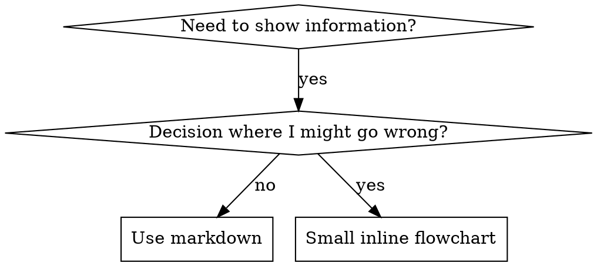

# Writing Skills

**Writing skills IS test-driven development applied to process documentation.**

You write a test (a pressure scenario with a subagent), watch it fail (baseline behavior), write the skill, watch it pass (the agent now complies), and refactor (close loopholes).

**Core principle:** if you didn't watch an agent fail without the skill, you don't know if the skill teaches the right thing.

**REQUIRED BACKGROUND:** you MUST understand `powers:test-driven-development` before using this skill. That skill defines the RED-GREEN-REFACTOR cycle. This one adapts TDD to documentation.

**Personal skills live in agent-specific directories** (`~/.claude/skills` for Claude Code, `~/.agents/skills/` for Codex, plugin-installed for Copilot CLI).

**Official guidance:** Anthropic's skill authoring best practices live in `anthropic-best-practices.md`.

## What is a skill?

A reference for proven techniques, patterns, or tools. Skills help future agents find and apply effective approaches.

**Skills are:** reusable techniques, patterns, tools, reference guides.

**Skills are NOT:** narratives about how you solved a problem once.

## TDD mapping for skills

| TDD concept | Skill creation |
|---|---|
| Test case | Pressure scenario with a subagent |
| Production code | The SKILL.md document |
| RED | Subagent violates the rule without the skill |
| GREEN | Subagent complies with the skill present |
| Refactor | Close loopholes while maintaining compliance |
| Write test first | Run baseline scenario BEFORE writing the skill |
| Watch it fail | Document the exact rationalizations the subagent uses |
| Minimal code | Skill addresses those specific violations |
| Watch it pass | Subagent now complies |
| Refactor cycle | Find new rationalizations → plug → re-verify |

The whole skill creation process follows RED-GREEN-REFACTOR.

## When to create a skill

**Create when:**

- Technique wasn't intuitively obvious to you.
- You'd reference it again across projects.
- Pattern applies broadly (not project-specific).
- Others would benefit.

**Don't create for:**

- One-off solutions.
- Standard practices well-documented elsewhere.
- Project-specific conventions (put in CLAUDE.md / AGENTS.md).
- Mechanical constraints enforceable by regex / validation (automate it; reserve docs for judgment calls).

## Skill types

- **Technique** — a concrete method with steps (`condition-based-waiting`, `root-cause-tracing`).
- **Pattern** — a way of thinking about problems (`flatten-with-flags`, `test-invariants`).
- **Reference** — API docs, syntax guides, tool references.

## Directory structure

```text
skills/
  skill-name/
    SKILL.md              # main reference (required)
    supporting-file.*     # only if needed
```

Flat namespace. All skills in one searchable namespace.

**Separate files for:**

1. Heavy reference (100+ lines) — API docs, comprehensive syntax.
2. Reusable tools — scripts, utilities, templates.

**Keep inline:**

- Principles and concepts.
- Code patterns (< 50 lines).
- Everything else.

## SKILL.md structure

**Frontmatter (YAML), max 1024 chars total:**

- Two required fields: `name` and `description`. See [agentskills.io/specification](https://agentskills.io/specification).
- `name`: letters, numbers, hyphens only.
- `description`: third person, **only** when to use — NOT what the skill does.
  - Start with "Use when…" to focus on triggering conditions.
  - Include specific symptoms, situations, contexts.
  - **Never summarize the skill's process or workflow** (see CSO section for why).
  - Aim for under 500 chars.

```markdown
---
name: skill-name-with-hyphens
description: Use when [specific triggering conditions and symptoms]
---

# Skill Name

## Overview
What is this? Core principle in 1-2 sentences.

## When to Use
Small inline flowchart IF the decision is non-obvious.
Bullet list with symptoms and use cases.
When NOT to use.

## Core Pattern (techniques / patterns)
Before / after code comparison.

## Quick Reference
Table or bullets for scanning common operations.

## Implementation
Inline code for simple patterns.
Link to a file for heavy reference or reusable tools.

## Common Mistakes
What goes wrong + fixes.

## Real-World Impact (optional)
Concrete results.
```

## Claude Search Optimization (CSO)

Future agents need to FIND the skill.

### 1. Rich description field

Agents read the description to decide which skills to load. Make it answer: "Should I read this skill right now?"

**Critical: description = WHEN to use, NOT WHAT the skill does.**

Testing showed that when a description summarizes workflow, agents follow the description instead of reading the body. A description saying "code review between tasks" caused agents to do ONE review, even though the body's flowchart specified TWO reviews.

When the description was changed to just "Use when executing implementation plans with independent tasks", agents correctly read the flowchart.

```yaml
# ❌ BAD: summarizes workflow
description: Use when executing plans - dispatches subagent per task with code review between tasks

# ❌ BAD: too much process detail
description: Use for TDD - write test first, watch it fail, write minimal code, refactor

# ✅ GOOD: just triggers
description: Use when executing implementation plans with independent tasks in the current session

# ✅ GOOD: triggers only
description: Use when implementing any feature or bugfix, before writing implementation code
```

**Content rules:**

- Concrete triggers, symptoms, situations.
- Describe the *problem* (race conditions, inconsistent behavior), not language-specific symptoms (`setTimeout`, `sleep`).
- Keep triggers technology-agnostic unless the skill itself is technology-specific.
- Third person.
- Never summarize process or workflow.

```yaml
# ❌ BAD
description: For async testing
description: I can help you with async tests when they're flaky
description: Use when tests use setTimeout/sleep and are flaky

# ✅ GOOD
description: Use when tests have race conditions, timing dependencies, or pass/fail inconsistently
description: Use when using React Router and handling authentication redirects
```

### 2. Keyword coverage

Use words an agent would search for:

- Error messages: "Hook timed out", "ENOTEMPTY", "race condition".
- Symptoms: "flaky", "hanging", "zombie", "pollution".
- Synonyms: "timeout / hang / freeze", "cleanup / teardown / afterEach".
- Tools: actual commands, library names, file types.

### 3. Descriptive naming

Active voice, verb-first:

- ✅ `creating-skills`, ❌ `skill-creation`.
- ✅ `condition-based-waiting`, ❌ `async-test-helpers`.
- ✅ `root-cause-tracing`, ❌ `debugging-techniques`.
- ✅ `flatten-with-flags`, ❌ `data-structure-refactoring`.

Gerunds (`-ing`) work well for processes (`creating-skills`, `testing-skills`).

### 4. Token efficiency (critical)

`using-powers` and frequently-referenced skills load into every conversation. Every token matters.

**Targets:**

- Frequently-loaded skills: <200 words total.
- Other skills: <500 words.

**Techniques:**

Move details to tool help:

```text
❌ "search-conversations supports --text, --both, --after DATE, --before DATE, --limit N"
✅ "search-conversations supports multiple modes and filters. Run --help for details."
```

Use cross-references:

```text
❌ Repeat workflow details
✅ "REQUIRED: Use <other-skill-name> for workflow."
```

Compress examples:

```text
❌ Verbose dialogue example (40+ words)
✅ "Partner: '<question>' → You: 'Searching…' → [dispatch subagent → synthesis]"
```

Eliminate redundancy: don't repeat what's in cross-referenced skills, don't explain what's obvious from the command, don't include multiple examples of the same pattern.

Verify: `wc -w skills/path/SKILL.md`.

### 5. Cross-referencing other skills

Use the skill name only, with explicit requirement markers:

- ✅ `**REQUIRED SUB-SKILL:** Use powers:test-driven-development`.
- ✅ `**REQUIRED BACKGROUND:** You MUST understand powers:systematic-debugging`.
- ❌ `See skills/testing/test-driven-development` (unclear if required).
- ❌ `@skills/testing/test-driven-development/SKILL.md` (force-loads, burns context).

`@` syntax force-loads files immediately.

## Flowchart usage



**Use flowcharts ONLY for:** non-obvious decision points; process loops where you might stop too early; "when to use A vs B" decisions.

**Never:** reference material → tables; code → markdown blocks; linear instructions → numbered lists; labels without semantic meaning (`step1`, `helper2`).

See `graphviz-conventions.dot` for graphviz style rules.

**Visualizing for the human partner:** `render-graphs.js` in this directory renders to SVG.

```bash
./render-graphs.js ../some-skill           # each diagram separately
./render-graphs.js ../some-skill --combine # all in one SVG
```

## Code examples

One excellent example beats many mediocre ones.

Choose the most relevant language:

- Testing techniques → TypeScript / JavaScript.
- System debugging → Bash / Python.
- Data processing → Python.
- Infrastructure → IaC / config (YAML, HCL, etc.).

**Good:** complete and runnable; comments explain WHY; from a real scenario; shows the pattern; ready to adapt.

**Don't:** implement in 5+ languages; create fill-in-the-blank templates; write contrived examples.

You're good at porting — one great example is enough.

## File organization

### Self-contained

```text
defense-in-depth/
  SKILL.md    # everything inline
```

When: all content fits inline.

### With reusable tool

```text
condition-based-waiting/
  SKILL.md    # overview + patterns
  example.ts  # working helpers to adapt
```

When: tool is reusable code, not narrative.

### With heavy reference

```text
pptx/
  SKILL.md       # overview + workflows
  pptxgenjs.md   # 600 lines API reference
  ooxml.md       # 500 lines XML structure
  scripts/       # executable tools
```

When: reference material is too large for inline.

## The Iron Law (same as TDD)

```text
NO SKILL WITHOUT A FAILING TEST FIRST
```

Applies to NEW skills AND EDITS.

Wrote skill before testing? Delete. Start over. Edited skill without testing? Same violation.

**No exceptions:**

- Not for "simple additions".
- Not for "just adding a section".
- Not for "documentation updates".
- Don't keep untested changes as "reference".
- Don't "adapt" while running tests.
- Delete means delete.

## Testing all skill types

Different types need different test approaches:

### Discipline-enforcing skills (rules / requirements)

Examples: TDD, verification-before-completion.

Test with: academic questions (do they understand the rules?); pressure scenarios (do they comply under stress?); multiple combined pressures (time + sunk cost + exhaustion); identify rationalizations and add explicit counters.

Success: subagent follows the rule under maximum pressure.

### Technique skills (how-to)

Examples: condition-based-waiting, root-cause-tracing.

Test with: application scenarios; variation scenarios for edge cases; missing-information tests for instruction gaps.

Success: subagent successfully applies the technique to a new scenario.

### Pattern skills (mental models)

Examples: reducing-complexity.

Test with: recognition scenarios (do they recognize when the pattern applies?); application scenarios; counter-examples (do they know when NOT to apply?).

Success: subagent correctly identifies when and how to apply the pattern.

### Reference skills (docs / APIs)

Examples: API documentation, command references.

Test with: retrieval scenarios; application scenarios; gap testing for common cases.

Success: subagent finds and correctly applies the reference information.

## Common rationalizations for skipping testing

| Excuse | Reality |
|---|---|
| "Skill is obviously clear." | Clear to you ≠ clear to others. Test it. |
| "It's just a reference." | References have gaps. Test retrieval. |
| "Testing is overkill." | Untested skills have issues. 15 min testing saves hours. |
| "I'll test if problems emerge." | Problems = subagents can't use the skill. Test BEFORE deploying. |
| "Too tedious to test." | Less tedious than debugging in production. |
| "I'm confident it's good." | Overconfidence guarantees issues. |
| "Academic review is enough." | Reading ≠ using. |
| "No time to test." | Deploying untested skills wastes more time fixing later. |

All of these mean: test before deploying. No exceptions.

## Bulletproofing skills against rationalization

Discipline skills (like TDD) need to resist rationalization. Subagents are smart and find loopholes under pressure.

Psychology note: see `persuasion-principles.md` (Cialdini, 2021; Meincke et al., 2025) for authority, commitment, scarcity, social proof, unity.

### Close every loophole explicitly

Don't just state the rule — forbid specific workarounds:

<Bad>

```markdown
Write code before test? Delete it.
```

</Bad>

<Good>

```markdown
Write code before test? Delete it. Start over.

**No exceptions:**
- Don't keep it as "reference".
- Don't "adapt" it while writing tests.
- Don't look at it.
- Delete means delete.
```

</Good>

### Address "spirit vs letter" arguments

Add the foundational principle early:

```markdown
**Violating the letter of the rules is violating the spirit of the rules.**
```

Cuts off "I'm following the spirit" rationalizations.

### Build a rationalization table

Capture rationalizations from baseline testing. Every excuse goes in:

```markdown
| Excuse | Reality |
|---|---|
| "Too simple to test." | Simple code breaks. Test takes 30s. |
| "I'll test after." | Passing immediately proves nothing. |
```

### Create a red flags list

Make self-checks easy:

```markdown
## Red flags — STOP and start over

- Code before test.
- "I already manually tested it".
- "Tests after achieve the same purpose".
- "It's about spirit not ritual".

All mean: delete. Start over with TDD.
```

### Update CSO with violation symptoms

Add to description: symptoms of being ABOUT to violate the rule.

```yaml
description: Use when implementing any feature or bugfix, before writing implementation code
```

## RED-GREEN-REFACTOR for skills

### RED — failing test (baseline)

Run a pressure scenario with a subagent WITHOUT the skill. Document exact behavior:

- What choices did they make?
- What rationalizations did they use (verbatim)?
- Which pressures triggered violations?

You must see what subagents naturally do before writing the skill.

### GREEN — minimal skill

Write a skill that addresses those specific rationalizations. Don't add extra content for hypothetical cases.

Run the same scenarios WITH the skill. Subagent should now comply.

### REFACTOR — close loopholes

Subagent found a new rationalization? Add an explicit counter. Re-test until bulletproof.

**Methodology:** see `testing-skills-with-subagents.md` for pressure scenarios, pressure types (time, sunk cost, authority, exhaustion), plugging holes, meta-testing.

## Anti-patterns

- **Narrative example.** *"In session 2025-10-03, we found empty projectDir caused…"* — too specific, not reusable.
- **Multi-language dilution.** `example-js.js`, `example-py.py`, `example-go.go` — mediocre quality, maintenance burden.
- **Code in flowcharts.** `step1 [label="import fs"];` — can't copy-paste, hard to read.
- **Generic labels.** `helper1`, `helper2`, `step3` — labels should have semantic meaning.

## STOP — before moving to the next skill

After writing ANY skill, you MUST stop and complete deployment.

**Do NOT:**

- Create multiple skills in batch without testing each.
- Move on before the current one is verified.
- Skip testing because "batching is more efficient".

The deployment checklist below is mandatory for EACH skill.

## Skill creation checklist (TDD-adapted)

Create a todo per item.

**RED — failing test:**

- [ ] Create pressure scenarios (3+ combined pressures for discipline skills).
- [ ] Run scenarios WITHOUT the skill — document baseline verbatim.
- [ ] Identify patterns in the rationalizations / failures.

**GREEN — minimal skill:**

- [ ] Name: letters, numbers, hyphens only.
- [ ] YAML frontmatter with `name` and `description` (max 1024 chars).
- [ ] Description starts with "Use when…", lists specific triggers / symptoms.
- [ ] Description in third person.
- [ ] Keywords throughout (errors, symptoms, tools).
- [ ] Clear overview with core principle.
- [ ] Address specific baseline failures.
- [ ] Code inline OR link to a file.
- [ ] One excellent example (not multi-language).
- [ ] Run scenarios WITH the skill — subagents now comply.

**REFACTOR — close loopholes:**

- [ ] Identify NEW rationalizations.
- [ ] Add explicit counters (discipline skills).
- [ ] Build a rationalization table.
- [ ] Create a red flags list.
- [ ] Re-test until bulletproof.

**Quality checks:**

- [ ] Small flowchart only if the decision is non-obvious.
- [ ] Quick-reference table.
- [ ] Common-mistakes section.
- [ ] No narrative storytelling.
- [ ] Supporting files only for tools or heavy reference.

**Deployment:**

- [ ] Commit and push.
- [ ] Consider contributing back via PR if broadly useful.

## Discovery workflow

How a future agent finds your skill:

1. Encounters a problem ("tests are flaky").
2. Searches.
3. Finds the skill (description matches).
4. Scans the overview (relevant?).
5. Reads patterns (quick reference table).
6. Loads the example only when implementing.

Optimize for this flow — searchable terms early and often.

## Bottom line

Creating skills IS TDD for process documentation.

Same Iron Law: no skill without a failing test first.
Same cycle: RED (baseline) → GREEN (write skill) → REFACTOR (close loopholes).
Same benefits: better quality, fewer surprises, bulletproof results.

If you follow TDD for code, follow it for skills.
